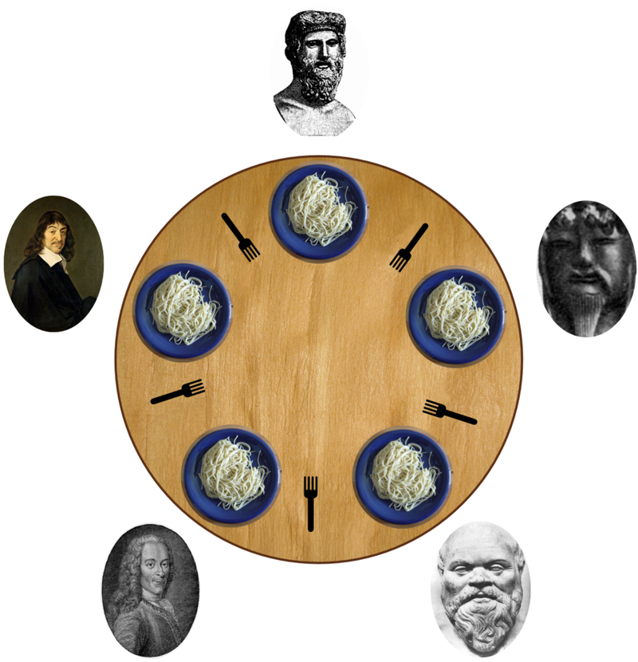

# Dining Philosophers – Semaphore-Based Synchronization

This program is a C++ simulation of the classic **Dining Philosophers Problem**, implemented using custom semaphores to manage access to shared resources (forks) and avoid deadlock.

---

## Problem Description

Five philosophers sit around a table. Each has their own plate and there is one fork between each plate. To eat, a philosopher needs both forks. Each philosopher can only alternately think and eat. Two forks will only be available when their two nearest neighbors are thinking, not eating. After a philosopher finishes eating, they will put down both forks. The problem is to ensure that no deadlock or starvation occurs as each philosopher alternates between thinking and eating.


---

### Key Challenges:
- Preventing **deadlock** (where all philosophers wait forever for forks).
- Ensuring **mutual exclusion** over shared forks.
- Allowing a **maximum of 4** philosophers to eat simultaneously to avoid circular wait.

---

## Solution Strategy

- Each fork is protected by a **binary semaphore**.
- A **counting semaphore (`diningRoom`)** is used to limit the number of philosophers who can attempt to eat at the same time (to 4 out of 5).
- A **mutex** is used for clean console output to avoid interleaved messages.
---

## How It Works

Each philosopher:
1. Waits to take a fork from the table (only 4 allowed).
2. Picks up their left and right forks (semaphores).
3. Eats for a random time up to 1000ms.
4. Releases the forks.
5. Signals so the neighbour can take the fork.

---

## Solution: [dining-philosophers.cc](dining-philosophers.cc)

This file implements:
- `Philosopher` class for each thread.
- Dining loop with a meal counter (3 meals per philosopher).
- Use of `Semaphore` (custom implementation from [semaphore.h](semaphore.h)).

---

## Compilation and execution

Ensure `semaphore.h` is present in the same directory.

```bash
g++ airport.cc thread-semaphore.cpp -o dining -lpthread

./dining
